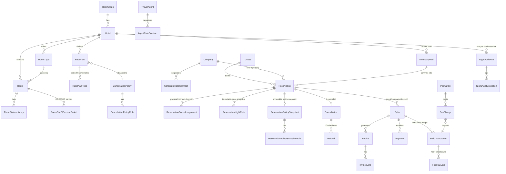

# StayOps India

An India-first, multi-property hospitality Property Management System (PMS) built as an
interview-ready portfolio project: **ASP.NET Core 10 / C# 14** API, **SQL Server** (EF Core 10 +
Dapper), and an **Angular 19 + Angular Material** frontend, in a Clean Architecture solution.

Scope is deliberately bounded: **India only, INR only, direct hotel-website booking only**, GST
(CGST+SGST/IGST) as the only tax model, and mock/sandbox adapters for payment and POS. See
[Limitations](#limitations) for exactly what is - and is not - real.

---

## Table of contents

- [Architecture](#architecture)
- [Entity-relationship diagram](#entity-relationship-diagram)
- [Setup](#setup)
- [Running the API](#running-the-api)
- [Running the frontend](#running-the-frontend)
- [Running with Docker Compose](#running-with-docker-compose)
- [Demo credentials](#demo-credentials)
- [API summary](#api-summary)
- [Database indexes](#database-indexes-and-why-they-exist)
- [Running tests](#running-tests)
- [Limitations](#limitations)
- [Repository layout](#repository-layout)

---

## Architecture

Clean Architecture, four layers, dependencies pointing inward:

```
src/
  StayOps.Domain/           Entities, enums - no framework dependencies at all
  StayOps.Application/      DTOs, validators, application services (business logic), interfaces
  StayOps.Infrastructure/   EF Core, Dapper, Identity, JWT, background services, mock adapters
  StayOps.Api/               Thin controllers, middleware, DI wiring, Swagger
  StayOps.Tests/             xUnit: unit, API integration, stored-procedure, concurrency tests
database/
  01-schema/                 EF Core migration exported as SQL (documentation artifact only)
  02-indexes/                 Hand-written indexes beyond what EF Fluent config expresses
  03-views/                   Reporting views
  04-stored-procedures/       Every transactional workflow + report (see API summary)
  05-seed-data/                Empty by design - see database/05-seed-data/NOTES.md
frontend/
  stayops-web/                Angular 19 standalone-components app, Angular Material
```

**Data access split** (per the brief): EF Core owns normal CRUD and migrations (hotels, rooms,
guests, rate plan headers, admin screens). **Every transactional workflow and every report goes
through a stored procedure, called via Dapper** - holds, reservations, cancellations, check-in/out,
folio postings, POS charges, Night Audit, and all four reports. Application services never contain
raw ad-hoc SQL; controllers never contain business logic.

**Why this matters for the online-vs-reception requirement**: the single hardest requirement in
the brief is "online booking and reception booking must use the same SQL Server inventory logic."
This is enforced structurally, not by convention: `sp_CreateReservation` (reception) calls
`sp_CreateInventoryHold` and `sp_ConfirmOnlineReservation` (the online path) directly via
`INSERT ... EXEC`, rather than re-implementing the availability check. There is exactly one
overbooking-prevention code path in the whole system - see
`database/04-stored-procedures/02_sp_CreateInventoryHold.sql` and `05_sp_CreateReservation.sql`.

### Key design decisions worth knowing for an interview

| Decision | Why |
|---|---|
| Overbooking prevention via `sp_getapplock` keyed on `(HotelId, RoomTypeId)` | Serializes concurrent hold attempts for the same room type without locking the whole table; proven under real concurrent load in `InventoryHoldConcurrencyTests`. |
| Reservation-rate snapshot (`ReservationNightRates`) taken at confirm time, never recalculated | A confirmed reservation's price/GST/inclusions must never change because a rate plan or GST rule changed later. |
| Cancellation-policy snapshot (`ReservationPolicySnapshot`) copied at booking time | Same reasoning - editing a live policy must never retroactively change a guest's already-agreed terms. |
| Night Audit posts each stay/date in its own small transaction, not one giant transaction | A single bad row must not roll back an entire hotel's audit; failures are captured as `NightAuditException` rows and the run still completes, matching real front-office operational expectations. |
| Refunds are additive rows, never edits to the original `Payment` | "Never overwrite original payment records" - refund lifecycle (`RefundRequested → Approved → SentToGateway → Succeeded/Failed`) is its own table. |
| `sp_PostFolioCharge` is one shared charge-posting primitive | Used by manual folio charges, Night Audit's nightly room charge, and POS - one GST-computation implementation, not three. |
| GST rate *resolution* happens at posting time; CGST+SGST vs IGST *split* is decided at invoice-generation time | A charge's tax percentage is fixed by its tariff slab at posting time, but whether it is intra- or inter-state depends on who ends up being billed (guest vs. company), which can change via folio transfer after the charge is posted. |

---

## Entity-relationship diagram



---

## Setup

### Prerequisites

| Tool | Version used in this build |
|---|---|
| .NET SDK | 10.0.302 |
| Node.js | 24.x |
| npm | 11.x |
| SQL Server | LocalDB (bundled with Visual Studio) for this demo - see note below; any SQL Server 2022 Developer/Express/Standard instance works |
| Docker (optional) | Only needed for `docker compose up` |

> **Why LocalDB, not a full SQL Server instance, for this build**: this session's environment had
> a domain-joined shared SQL Server instance that the build account could not authenticate
> against. `(localdb)\MSSQLLocalDB` was used as a documented demo default instead - it is the same
> SQL Server Express database engine, just instanced per-user. Point
> `ConnectionStrings:DefaultConnection` in `src/StayOps.Api/appsettings.json` at any real SQL
> Server 2022 instance for a non-demo environment; nothing in the schema, indexes, views, or
> stored procedures is LocalDB-specific.

### Clone and restore

```powershell
git clone <this-repo>
cd "StayOps India"
dotnet restore
```

## Running the API

**Zero manual database setup required.** The API applies EF Core migrations, then every SQL
script under `database/02-indexes`, `database/03-views`, and `database/04-stored-procedures`, then
seeds demo data - all automatically, every time it starts, all idempotently.

```powershell
dotnet run --project src/StayOps.Api
```

- Swagger UI: `https://localhost:<port>/swagger` (shown in the console on startup)
- Health check: `GET /health`
- Demo data seeded on first run: 2 hotels, room types/rooms, GST rules, cancellation policies,
  rate plans, a corporate account + contract, a travel agent + contract, a POS outlet, guests,
  6 demo users (one per role), and 4 sample stays (a paid-and-invoiced checkout, a live
  checked-in stay with a POS charge, an upcoming corporate-billed booking, and a cancelled
  online booking with a pending refund) - all created by calling the real stored procedures, not
  raw INSERTs (see `SampleStaySeeder`).

If you ever need to (re-)apply just the database layer without starting the API (e.g. CI), run:

```powershell
.\scripts\setup-database.ps1
```

## Running the frontend

```powershell
cd frontend/stayops-web
npm install
npm start          # ng serve, http://localhost:4200
```

`src/environments/environment.ts` points the dev build at `http://localhost:5080/api/v1` - update
it if your API runs on a different port.

## Running with Docker Compose

```powershell
docker compose up --build
```

Brings up SQL Server 2022, the API (`http://localhost:8080`), and the Angular app served by nginx
(`http://localhost:4200`, reverse-proxying `/api/*` to the API container). The API image ships its
own copy of `database/` and runs the identical automatic migrate → script → seed sequence as local
dev.

> **Honesty note**: Docker was not available in the sandbox this project was built in, so
> `docker-compose.yml` and both Dockerfiles are written to the same patterns used and verified
> throughout this build (multi-stage .NET publish, multi-stage Angular build served by nginx,
> SQL Server container with a healthcheck gate) but have **not been executed end-to-end** in this
> session. Everything else in this README (API, database, frontend, tests) has been run and
> verified directly.

---

## Demo credentials

All demo users share the password **`Passw0rd!123`**.

| Username | Role | Hotel scope |
|---|---|---|
| `superadmin` | SuperAdmin | All hotels |
| `manager.mumbai` | HotelManager | Mumbai (MUM01) |
| `manager.bangalore` | HotelManager | Bangalore (BLR01) |
| `reception.mumbai` | Receptionist | Mumbai |
| `finance.mumbai` | FinanceUser | Mumbai |
| `housekeeping.mumbai` | Housekeeper | Mumbai |
| `pos.mumbai` | POSSystem | Mumbai (outlet `REST01`, API key `pos-demo-key-123456`, header `X-Pos-Api-Key`) |

Login: `POST /api/v1/auth/login { "userNameOrEmail": "...", "password": "Passw0rd!123" }`.

---

## API summary

All routes are under `/api/v1`. Full request/response contracts are in Swagger.

| Area | Key endpoints |
|---|---|
| Auth | `POST /auth/login`, `POST /auth/refresh`, `POST /auth/logout`, `GET /auth/me` |
| Hotels/rooms | `GET/POST /hotels`, `/hotels/{id}/room-types`, `/hotels/{id}/rooms`, `/hotels/{id}/rooms/{id}/status`, `/hotels/{id}/rooms/{id}/out-of-service` |
| Guests | `GET /guests` (paged/filtered/sorted), `POST/PUT /guests` |
| Availability | `GET /hotels/{id}/availability` - shared by online and reception |
| Online booking (anonymous) | `POST /online/holds`, `POST /online/payments/webhook` |
| Reception booking | `POST /hotels/{id}/reservations`, `POST /hotels/{id}/inventory-holds`, `POST /hotels/{id}/inventory-holds/{id}/confirm` |
| Reservations | `GET /hotels/{id}/reservations`, `GET /reservations/{id}`, `GET /reservations/{id}/night-rates`, `POST /reservations/{id}/{cancel|no-show|check-in|check-out|move-room}` |
| Folios/billing | `GET /reservations/{id}/folios`, `POST /folios/{id}/{charges|payments|invoices}`, `POST /folios/transfers` |
| Refunds | `GET /hotels/{id}/refunds`, `POST /refunds/{id}/{approve|mark-failed}` |
| POS | `POST /pos/post-charge` (JWT + `X-Pos-Api-Key` header) |
| Night Audit | `POST /hotels/{id}/night-audit/run`, `GET /hotels/{id}/night-audit/{history|runs/{id}/exceptions}` |
| Reports | `GET /hotels/{id}/reports/{occupancy|revenue-gst|refunds-cancellations|corporate-receivables}` |
| Admin | Rate plans + prices, corporate accounts + contracts, travel agents + contracts, cancellation policies + rules, GST rules |

### Required stored procedures (all present, all Dapper-invoked)

`sp_SearchAvailableRoomTypes`, `sp_CreateInventoryHold`, `sp_ExpireInventoryHolds`,
`sp_ConfirmOnlineReservation`, `sp_CreateReservation`, `sp_CancelReservation`,
`sp_CheckInGuest`, `sp_CheckOutGuest`, `sp_SetRoomOutOfOrder`, `sp_RunNightAudit`,
`sp_TransferFolioCharge`, `sp_RecordFolioPayment`, `sp_GenerateGstInvoice`,
`sp_PostPosChargeToFolio`, `sp_GetOccupancyReport`, `sp_GetDailyRevenueAndGstReport`,
`sp_GetRefundAndCancellationReport`.

Supporting (not individually required by name, but load-bearing): `sp_ReturnRoomToService`,
`sp_PostFolioCharge` (shared charge-posting primitive), `sp_GetCorporateReceivablesReport`, plus
`fn_RoomTypeAvailableCount`, `fn_ResolveNightlyRate`, `fn_ResolveGstRule` /
`fn_ResolveRoomTariffGst` helper functions.

---

## Database indexes (and why they exist)

Beyond the indexes EF Core's Fluent configuration creates for foreign keys and the explicit unique
constraints called out in each entity configuration (e.g. `Reservations.ReservationNumber`,
filtered-unique `Reservations.IdempotencyKey` / `Payments.IdempotencyKey` /
`FolioTransactions.UniquePostingKey`), `database/02-indexes/01_indexes.sql` adds:

| Index | Purpose |
|---|---|
| `IX_Reservations_Dashboard_Arrivals` / `_Departures` | Covering index for the dashboard's "arrivals/departures today" queries (hotel + date + status, with guest/room-type included to avoid a key lookup). |
| `IX_FolioTransactions_BusinessDate_Type` | Both Night Audit and the daily revenue/GST report scan "every charge posted on business date X grouped by type" - this is that exact access pattern. |
| `IX_Rooms_Occupancy_Active` | Occupancy report counts active rooms by status per hotel on every call. |
| `IX_GstRules_Resolution` | GST rule resolution (category + active + effective-dated) runs on every single charge posted anywhere in the system. |
| `IX_HousekeepingTasks_Board` | The housekeeping board's default view: pending/in-progress tasks for a hotel, oldest first. |

Plus, inline in the entity configurations: `IX_InventoryHolds` on `(HotelId, RoomTypeId, Status, CheckInDate, CheckOutDate)`
and the identical shape on `Reservations` - this is the composite index the overbooking-prevention
demand calculation (`fn_RoomTypeAvailableCount`) scans on every availability search and every hold
attempt.

---

## Running tests

```powershell
dotnet test src/StayOps.Tests
```

Requires the database to be reachable (LocalDB by default) - the integration/concurrency/stored-
procedure tests boot the real API via `WebApplicationFactory<Program>` against it, which triggers
the same automatic migrate/script/seed sequence as `dotnet run`. Tests create their own rows via
fresh GUIDs/idempotency keys and far-future date ranges, so they're safe to run repeatedly without
resetting the database, and safe to run alongside the seeded demo data.

**24 tests, all passing** as of this build:

- **Unit** (`Tests/Unit`): JWT token generation/claims/expiry/hashing, FluentValidation rule
  behavior (state-code format, GST charge-type restrictions).
- **API integration** (`Tests/Integration`): login/refresh-token-reuse-rejection/hotel-scoping,
  full reception-booking-to-availability-decrement flow, idempotent reservation/cancellation
  retries, and a full check-in → post-charge → pay → zero-balance → GST-invoice flow with exact
  tax-amount assertions.
- **Stored procedure** (`Tests/StoredProcedures`): GST tariff-slab resolution across all three
  slabs directly against SQL Server; availability-count bounds checking.
- **Concurrency** (`Tests/Concurrency`): fires more simultaneous `sp_CreateInventoryHold` calls
  than a room type has physical rooms and asserts the successful count exactly equals the room
  count - proof overbooking prevention holds under real concurrent load, not just in theory.

Test classes run sequentially (`DisableTestParallelization = true` in `AssemblyInfo.cs`) because
several tests intentionally contend for the same SQL Server `sp_getapplock` resource against the
same shared LocalDB database; the concurrency test itself still fires genuinely parallel requests
internally via `Task.WhenAll`.

---

## Limitations

Explicitly out of scope or simplified, per the project brief:

- **India only, INR only.** No multi-currency, no FX.
- **GST is a simplified educational model**, not verified legal tax compliance. Real Indian GST law
  treats hotel accommodation as always intra-state (place of supply = hotel location); this build
  instead compares hotel state vs. billed-party state to demonstrate both CGST+SGST and IGST code
  paths, since that split was an explicit brief requirement. GSTIN formats, slab thresholds, and
  rates in seed data are illustrative, not current law.
- **No live payment gateway.** `IMockPaymentGateway` is a same-process, no-network mock. Payments
  always succeed synchronously; refunds simulate an async gateway callback via a background
  service after a fixed delay. Not PCI-DSS scoped in any way.
- **No real POS hardware integration.** `POST /api/v1/pos/post-charge` is authenticated PMS-side
  (outlet API key + JWT), but there is no physical terminal, EDC, or vendor protocol involved.
- **No OTA integration** (Booking.com, Agoda, etc.) and **no AI/dynamic pricing.** Travel-agent and
  corporate contracts are manually configured, not synced from any channel manager.
- **Direct hotel-website booking only** - the "Online Booking Demo" screen simulates a hotel's own
  booking page, not a third-party channel.
- **OOO/OOS Room.Status is set at request/return time**, not swept continuously by date. Since
  `fn_RoomTypeAvailableCount` and `sp_GetOccupancyReport` always read the date-ranged
  `RoomOutOfServicePeriods` table directly, availability and occupancy are correct for any date
  regardless of this; only the *live room board's* current-status field depends on
  `sp_SetRoomOutOfOrder`/`sp_ReturnRoomToService` having been called at the right time.
- **Angular UI was verified via build/serve and direct API contract testing, not a live browser
  session** - no browser automation tool was available in the session this was built in. Every
  screen calls endpoints that were independently exercised and verified via the test suite and
  manual HTTP testing during development.
- **Docker Compose is written but not executed** in this session (no Docker available) - see the
  note in [Running with Docker Compose](#running-with-docker-compose).
- Money is `decimal` everywhere, technical timestamps are UTC, hotel operations use the hotel's own
  `BusinessDate`/`TimeZoneId` - but there is a single demo-documented simplification: cancellation
  penalty windows treat local midnight of the check-in date as "check-in time" (no per-hotel
  configurable check-in/check-out clock time).

## Repository layout

```
StayOps.slnx
docker-compose.yml
scripts/setup-database.ps1
database/{01-schema,02-indexes,03-views,04-stored-procedures,05-seed-data}/
src/{StayOps.Domain,StayOps.Application,StayOps.Infrastructure,StayOps.Api,StayOps.Tests}/
frontend/stayops-web/
```
